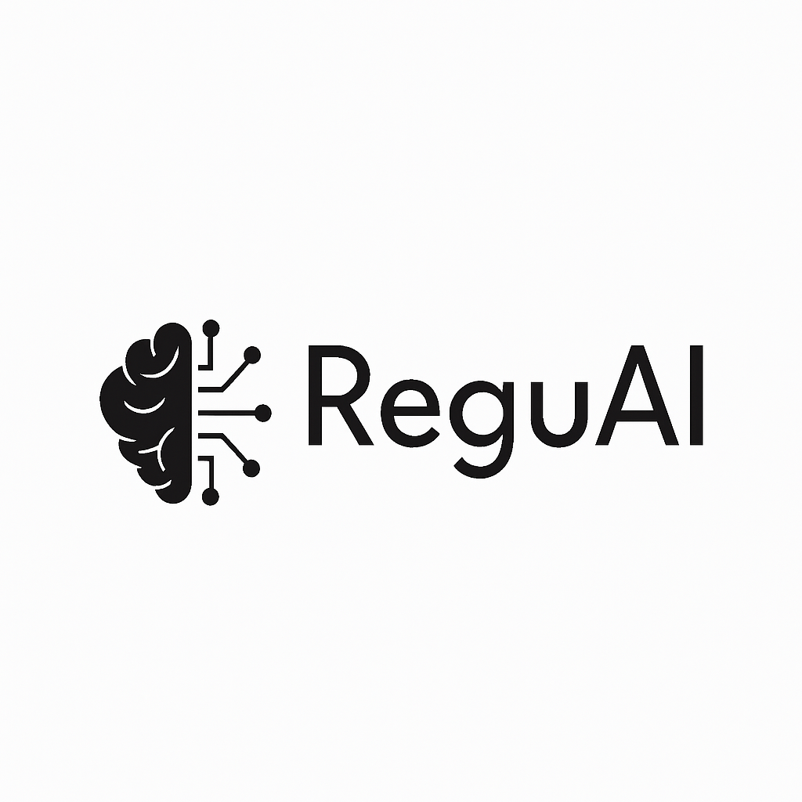

# ReguAI - Regulatory Intelligence Assistant



**Datathon PolyFinances 2025**

ReguAI est une application web interactive permettant d'analyser l'impact des réglementations sur le portefeuille S&P 500 en utilisant l'IA générative (Amazon Bedrock).

## Vision

ReguAI transforme la complexité réglementaire en opportunité d'aide à la décision pour la gestion de portefeuilles d'actions. Notre système analyse automatiquement les réglementations, identifie les entreprises à risque, et génère des recommandations de trading basées sur l'IA.

## Fonctionnalités

- **Dashboard** : Vue globale du portefeuille S&P 500 avec visualisations interactives
- **Analyse de Documents** : Extraction automatique d'informations depuis documents réglementaires
- **Chatbot Financier** : Interface conversationnelle pour poser des questions
- **Analyse d'Impact** : Calcul de l'impact réglementaire sur les entreprises

## Installation et Démarrage

### Prérequis

- Python 3.8+
- AWS Account (pour Bedrock, Textract, S3)
- Credentials AWS configurés

### 1. Installer les dépendances

```bash
pip install -r requirements.txt
```

**Note** : L'installation peut prendre du temps car elle inclut PyTorch et LegalBERT (~1.5 GB).

### 2. Configuration AWS

Créez un fichier `.env` à la racine du projet :

```bash
# Obligatoire pour Bedrock (extraction et RAG)
AWS_ACCESS_KEY_ID=votre_access_key
AWS_SECRET_ACCESS_KEY=votre_secret_key
AWS_REGION=us-east-1

# Optionnel (pour cache S3)
S3_BUCKET_NAME=datathon-reguai
```

**Services AWS requis** :
- **Amazon Bedrock** (obligatoire) : Modèles Claude et Cohere pour extraction et RAG
- **Amazon S3** (optionnel) : Cache des extractions
- **Amazon Textract** (optionnel) : Extraction de texte depuis PDF
- **Amazon Comprehend** (optionnel) : Pré-filtrage pour réduire les coûts

### 3. Lancer l'application

```bash
python -m streamlit run scripts/app.py
```

L'application s'ouvrira automatiquement à `http://localhost:8501`

## Structure du Projet

```
ReguAI/
├── scripts/
│   ├── app.py                              # Application Streamlit principale
│   ├── helpers/                            # Modules d'aide
│   │   ├── dashboard_helper.py
│   │   ├── document_analysis_helper.py
│   │   ├── aws_services_helper.py
│   │   └── impact_helper.py
│   ├── processing/                         # Traitement de documents
│   │   └── process_regulatory_document.py
│   ├── impact/                             # Analyse d'impact réglementaire
│   │   ├── impact_calculator.py
│   │   ├── impact_orchestrator.py
│   │   └── streamlit_impact_runner.py
│   ├── recommendations/                    # Génération de recommandations
│   │   ├── recommendation_generator.py
│   │   ├── signal_generator.py
│   │   └── generate_recommendations_per_directive.py
│   ├── rag/                                # Système RAG
│   │   ├── config.py
│   │   ├── data_loader.py
│   │   ├── embeddings.py
│   │   ├── vector_store.py
│   │   ├── rag_chain.py
│   │   └── rag_helper.py
│   └── utils/                              # Scripts utilitaires
│       ├── clear_rag_cache.py
│       └── reset_document_analysis.py
├── notebooks/
│   ├── intro/
│   │   ├── Introduction-Datathon.ipynb
│   │   └── getting_started.ipynb
│   └── extraction/
│       ├── extract_data_points_10k.ipynb
│       ├── extract_regulatory_files.ipynb
│       ├── extract_key_market_data.ipynb
│       └── generate_company_universe.ipynb
├── data/
│   ├── raw/
│   │   ├── directives/                      # Documents réglementaires bruts
│   │   ├── fillings/                        # Rapports 10-K bruts
│   │   ├── 2025-08-15_composition_sp500.csv
│   │   ├── 2025-09-26_stocks-performance.csv
│   │   └── jeu_de_donnees.zip
│   └── generated/
│       ├── company_universe/
│       │   └── company_universe.json        # Consolidation complète (500 entreprises)
│       ├── extracted_data_points/           # Points de données extraits (500+ fichiers JSON)
│       ├── extracted_directives/            # Documents réglementaires extraits
│       ├── impact_analysis/                 # Résultats d'analyse d'impact
│       ├── recommendations/                 # Recommandations de trading
│       └── key_market_data/
│           └── all_market_data.json
├── doc/
│   ├── Logo.png
│   ├── ReguAI.pdf
│   ├── TEAM-35_onepager.pdf
│   └── TEAM-35_video_datathon_2025.mov
├── requirements.txt
└── README.md
```

## Technologies Utilisées

**Interface et Visualisation**
- Streamlit, Plotly

**Traitement de Données**
- Pandas, NumPy

**IA et NLP**
- Amazon Bedrock (Claude, Cohere)
- LegalBERT (nlpaueb/legal-bert-base-uncased)
- Transformers (Hugging Face)
- PyTorch

**AWS Services**
- boto3, Amazon Textract, Amazon S3, Amazon Comprehend

**Parsing et Extraction**
- sec-parser, instructor[bedrock], BeautifulSoup4, lxml

**APIs Externes**
- yfinance, tavily-python

## Données Disponibles

### Company Universe
`data/generated/company_universe/company_universe.json` contient 500 entreprises S&P 500 avec :
- Market Data : Métriques financières, secteurs, ratios (P/E, marges, etc.)
- Data Points 10-K : Géographie, segments, supply chain, opérations

### Documents Réglementaires

**Europe** :
- Directive (UE) 2019/2161 du Parlement européen et du Conseil
- Règlement (EU) 2024/1689 (EU AI Act)

**États-Unis** :
- H.R.5376 - Inflation Reduction Act of 2022
- H.R.1 - One Big Beautiful Bill Act

**Asie** :
- 中华人民共和国能源法 (Loi sur l'énergie - Chine)
- 人工知能関連技術の研究開発及び活用の推進に関する法律 (Loi sur l'IA - Japon)

## Guide de Démarrage Rapide

### Analyser un Document Réglementaire

1. Lancer l'app : `streamlit run scripts/app.py`
2. Aller dans "Analyse de Documents"
3. Uploader un fichier (HTML, XML, PDF, TXT)
4. Cliquer "Analyser avec Bedrock"
5. Attendre 1-3 minutes pour l'extraction
6. Voir les résultats

### Utiliser le Chatbot RAG

1. Aller dans "Chatbot Financier"
2. Poser une question (ex: "Quel est l'impact de l'EU AI Act sur Apple ?")
3. Le système recherche dans la base de connaissances
4. Réponse contextuelle avec sources citées

### Analyser l'Impact Réglementaire

1. Aller dans "Analyse d'Impact"
2. Sélectionner une réglementation
3. Voir les entreprises affectées avec scores d'impact
4. Consulter les recommandations de trading

## Identité Visuelle

Le logo **ReguAI** représente l'intelligence artificielle appliquée à la réglementation :
- **Cerveau stylisé** : Hémisphère gauche avec plis naturels, hémisphère droit avec pattern de circuit board
- **Symbole** : Fusion entre intelligence humaine et technologie IA
- **Couleurs** : Vert émeraude (#10b981) pour l'innovation et la confiance

## État du Projet

**Statut** : Application complète et fonctionnelle

**Fonctionnalités implémentées** :
- Dashboard avec visualisations interactives
- Extraction automatique de documents réglementaires (Bedrock)
- Chatbot RAG avec base de connaissances complète
- Analyse d'impact réglementaire sur portefeuille S&P 500
- Génération de recommandations de trading
- Interface moderne et intuitive

## Ressources de Présentation

- **Vidéo de démonstration** : `doc/TEAM-35_video_datathon_2025.mov`
- **One-pager** : `doc/TEAM-35_onepager.pdf`
- **Documentation technique** : `doc/ReguAI.pdf`

## Exemple d'Utilisation

**Scénario** : Un gestionnaire de portefeuille veut analyser l'impact de l'EU AI Act sur son portefeuille S&P 500.

1. **Upload du document** : Le gestionnaire upload le document réglementaire
2. **Extraction automatique** : ReguAI extrait les informations clés
3. **Analyse d'impact** : Le système croise les données avec les rapports 10-K
4. **Recommandations** : ReguAI génère des signaux de trading (BUY/SELL/HOLD)
5. **Visualisation** : Dashboard interactif avec graphiques et métriques

**Résultat** : Analyse complète de l'impact réglementaire en quelques minutes avec recommandations actionnables.

---

**ReguAI** - *Transforming Regulatory Complexity into Strategic Portfolio Decisions*
